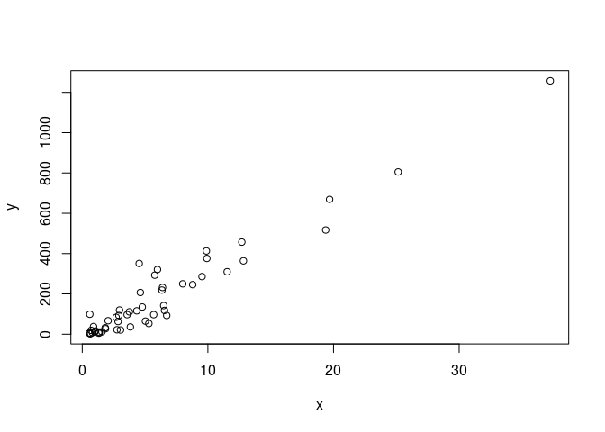
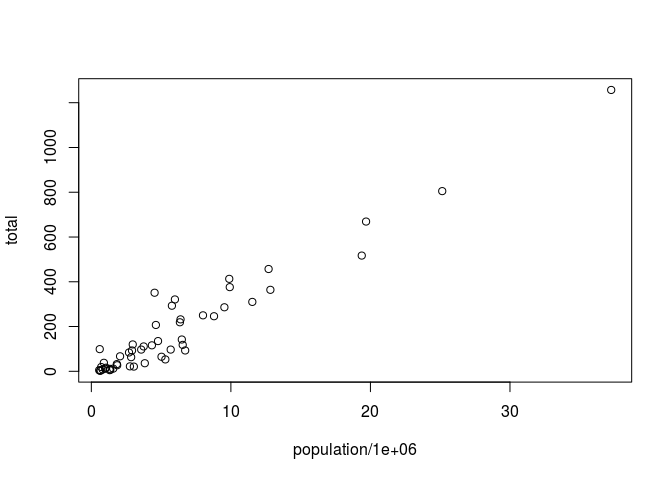
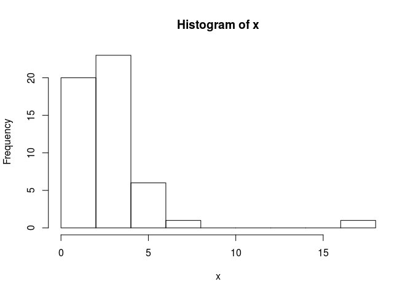
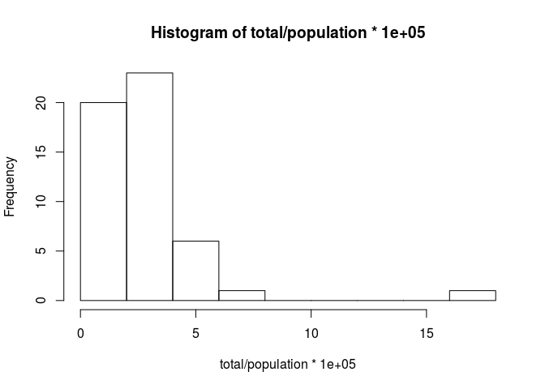
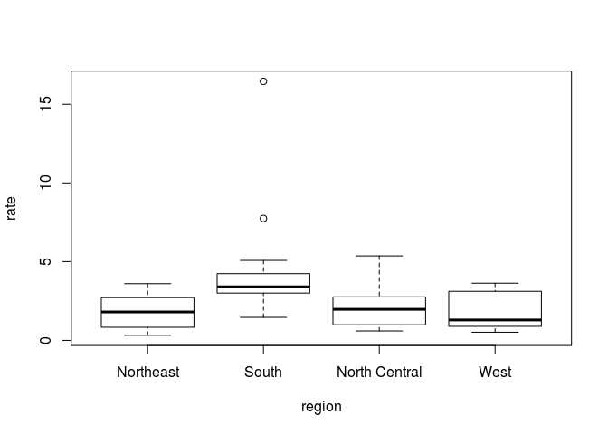
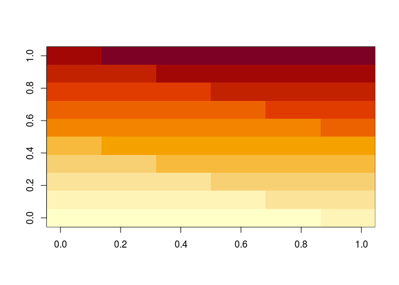
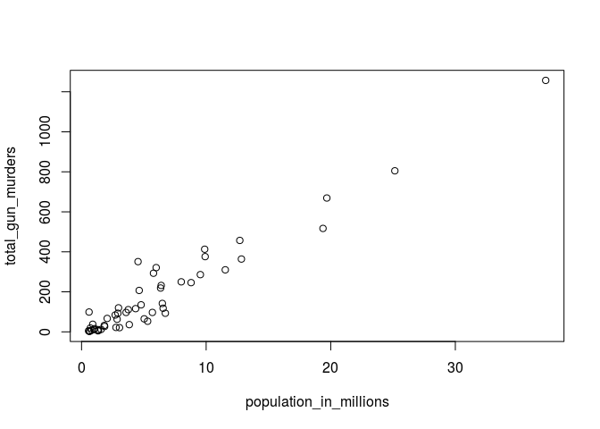
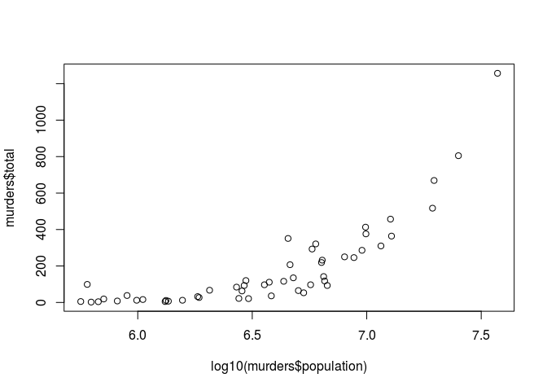
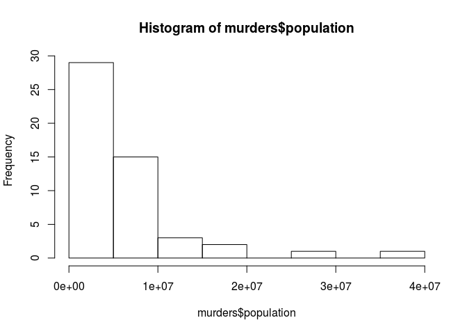
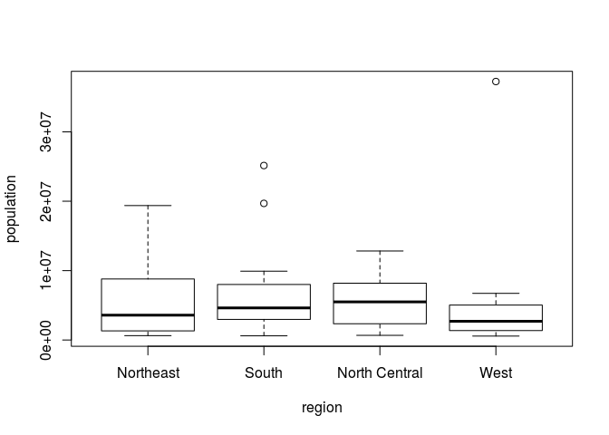

Chap3\_R\_Basics
================

-----

# 3.1 Case study : US Gun Murders

Imagine you live in Europe and are offered a job in a US company with
many locations across all states. It is a great job, but news with
headlines such as US Gun Homicide Rate Higher Than Other Developed
Countries have you worried. Charts like this may concern you even
more:

<center>

](https://rafalab.github.io/dsbook/R/img/homocides_g8_countries_640x360_wmain.jpg)

</center>

Or even wors, this version from
everytown.org:

<center>

](https://rafalab.github.io/dsbook/R/img/GunTrends_murders_per_1000.png)

</center>

But then you remember that the US is a large and diverse country with 50
very different states as well as the District of Columbia (DC).

California, for example, has a larger population than Canada, and 20 US
states have populations larger than that of Norway. In some respects,
the variability across states in the US is akin to the variability
across countries in Europe. Furthermore, although not included in the
charts above, the murder rates in Lithuania, Ukraine, and Russia are
higher than 4 per 100,000. So perhaps the news reports that worried you
are too superficial. You have options of where to live and want to
determine the safety of each particular state. We will gain some
insights by examining data related to gun homicides in the US during
2010 using R.

Before we get started with our example, we need to cover logistics as
well as some of the very basic building blocks that are required to gain
more advanced R skills. Be aware that the usefulness of some of these
building blocks may not be immediately obvious, but later in the book
you will appreciate having mastered these skills.

-----

# 3.2 The very basics

Before we get started with the motivating dataset, we need to cover
**the very basics of R**.

## 3.2.1 Objects

Suppose a high school students asks us for help sloving several
quadratic equations of the form \(ax^2+bx+c=0\). The quadratic formula
gives us the solutions:

<center>

\(\frac {-b-\sqrt{b^2-4ac}} {2a} and \frac {-b+\sqrt{b^2-4ac}} {2a}\)

</center>

which of course change deepending on the values of \(a,b\) and \(c\).
One advantage of programming languges is theat we can define wariables
and write expressions with these variables, similar to how we do so in
math, but obtain a numeric solution. We will write out general code for
the quadratic equation below, but if we are asked to solve
\(x^2+x-1=0\), then we define:

``` r
a <- 1

b <- 1

c <- -1 
```

which stores the values for later use. We use `<-` to assign values to
the variables.

We can also assign values using `=` instead of `<-`, but we recommend
against using `=` to avoid confusion.

Copy and paste the code above into your **console** to define the three
variables. Not the R does not print anything when we make this
assignment. THis means the objects were defined successfully. Had you
made a mistake, you would have received an error message.

To see the value stored in a variable, we simply ask R to evaluate `a`
and it show the sored value:

``` r
a
```

    ## [1] 1

A more explicit way to ask R to show us the value stored in `a` is using
`print` like this:

``` r
print(a)
```

    ## [1] 1

We use the term **object** to describe stuff that is stored in R.
Variables are examples, but objects can also be complicated entities
such as functions, which are described later.

## 3.2.2 The workspace

As we define objects in the console, we are actually changing the
*workspace*. You can see all the variables saved in your workspace by
typing :

``` r
ls()
```

    ## [1] "a" "b" "c"

In R studio, the *Environment* tab shows the values.

We should see `a`, `b`, and `c`. If you try to recover the value of a
variable that is not in your workspace, you receive an error. For
example, if you type `x` you will receive the follwing message : `Error
: object 'x'x not found.`.

Now since these values are saved in variables, to obtain a solution to
our equation, we use the quadratic formula:

``` r
(-b + sqrt(b^2 -4*a*c) ) / (2*a)
```

    ## [1] 0.618034

``` r
(-b - sqrt(b^2 -4*a*c) ) / (2*a)
```

    ## [1] -1.618034

## 3.2.3 Functions

Once you define variables, the data analysis process can usually be
described as a series of functions applied to the data. R includes
several predefined functions and most of the analysis pipelines we
construct make extensive use of these.

We already used the `install.packages`, `library`, and `ls` functions.
We also used the function `sqrt` to solve the quadratic equation above.
There are many more prebuilt functions and even more can be added
through packages. **These functions do not appear in the workspace
because you did not define them, but they are available for immediate
use.**

In general, we need to *use parentheses* to evaluate a function. If you
type `ls`, the function is not evaluated and instead R shows you the
code that defines the function. If you type ls() the function is
evaluated and, as seen above, we see objects in the workspace.

``` r
#show the full-length script of the function
ls
```

    ## function (name, pos = -1L, envir = as.environment(pos), all.names = FALSE, 
    ##     pattern, sorted = TRUE) 
    ## {
    ##     if (!missing(name)) {
    ##         pos <- tryCatch(name, error = function(e) e)
    ##         if (inherits(pos, "error")) {
    ##             name <- substitute(name)
    ##             if (!is.character(name)) 
    ##                 name <- deparse(name)
    ##             warning(gettextf("%s converted to character string", 
    ##                 sQuote(name)), domain = NA)
    ##             pos <- name
    ##         }
    ##     }
    ##     all.names <- .Internal(ls(envir, all.names, sorted))
    ##     if (!missing(pattern)) {
    ##         if ((ll <- length(grep("[", pattern, fixed = TRUE))) && 
    ##             ll != length(grep("]", pattern, fixed = TRUE))) {
    ##             if (pattern == "[") {
    ##                 pattern <- "\\["
    ##                 warning("replaced regular expression pattern '[' by  '\\\\['")
    ##             }
    ##             else if (length(grep("[^\\\\]\\[<-", pattern))) {
    ##                 pattern <- sub("\\[<-", "\\\\\\[<-", pattern)
    ##                 warning("replaced '[<-' by '\\\\[<-' in regular expression pattern")
    ##             }
    ##         }
    ##         grep(pattern, all.names, value = TRUE)
    ##     }
    ##     else all.names
    ## }
    ## <bytecode: 0x2ff3fa0>
    ## <environment: namespace:base>

``` r
ls()
```

    ## [1] "a" "b" "c"

Unlike `ls`, most functions require one or more arguments. Below is an
example of how we assign an object to the argument of the function
`log`. Remember that we earlier defined `a` to be 1:

``` r
log(a)
```

    ## [1] 0

You can find out what the function expects and what it does by reviewing
the very useful manuals included in R. You can get `help` by using the
help function like this:

``` r
help("log")
```

For most functions, we can also use this shorthand:

``` r
?log
```

The help page will show you what arguments the function is expecting.
For example, `log` needs `x` and `base` to run. However, some arguments
are required and others are optional. You can determine which arguments
are optional by noting in the help document that a **default value is
assigned with `=`**. Defining these is optional. For example, the base
of the function `log` defaults to `base = exp(1)` making log the natural
log by default. (default is the `ln`)

If you want a quick look at the arguments without opening the help
system, you can type:

``` r
args(log)
```

    ## function (x, base = exp(1)) 
    ## NULL

You can change the default values by simply assigning another object:

``` r
log(8, base = 2)
```

    ## [1] 3

Not that we have not been specifying the argument `x` as such :

``` r
log(x = 8, base = 2)
```

    ## [1] 3

The above code works, but we can save ourselves some typing: if no
argument name is used, R assumes you are entering arguments in the order
shown in the help file or by args. So by not using the names, it assumes
the arguments are `x` followed by `base`:

``` r
log(8,2)
```

    ## [1] 3

If using the arguments’ names, then we can include them in whatever
order we want:

``` r
log(base = 2, x = 8)
```

    ## [1] 3

**To specify arguments, we must use `=`, and cannot use `<-`.**

There are some exceptions to the rule that functions need the
parentheses to be evaluated. Among these, the most commonly used are the
arithmetic and relational operators. For example:

``` r
2 ^ 3 
```

    ## [1] 8

You can see the arithmetic operators by typing :

``` r
?"+"
```

and the relational opertators by typing :

``` r
?">"
```

``` r
x <- stats::rnorm(20)
x < 1 
```

    ##  [1] FALSE  TRUE  TRUE  TRUE  TRUE  TRUE FALSE  TRUE  TRUE  TRUE  TRUE
    ## [12]  TRUE  TRUE  TRUE FALSE FALSE  TRUE  TRUE  TRUE  TRUE

``` r
x[x > 0]
```

    ## [1] 1.0555309 0.9147869 0.8174549 1.1056820 1.3874745 2.3733306 0.4095757
    ## [8] 0.9305367

``` r
?'['
# Operators acting on vectors, matrices, arrays and lists to extract or replace parts. 
```

``` r
x_list <- x[ x<1 & x>0 ] 
class(x_list)
```

    ## [1] "numeric"

## 3.2.4 Other prebuilt objects

There are several datasets that are included for users to practice and
test out functions. You can see all the available datasets by typing:

``` r
#call prebuilt-dataset
data()
```

This shows you the object name for these datasets. These datasets are
objects that can be used by simply typing the name. For example, if you
type:

``` r
co2
```

    ##         Jan    Feb    Mar    Apr    May    Jun    Jul    Aug    Sep    Oct
    ## 1959 315.42 316.31 316.50 317.56 318.13 318.00 316.39 314.65 313.68 313.18
    ## 1960 316.27 316.81 317.42 318.87 319.87 319.43 318.01 315.74 314.00 313.68
    ## 1961 316.73 317.54 318.38 319.31 320.42 319.61 318.42 316.63 314.83 315.16
    ## 1962 317.78 318.40 319.53 320.42 320.85 320.45 319.45 317.25 316.11 315.27
    ## 1963 318.58 318.92 319.70 321.22 322.08 321.31 319.58 317.61 316.05 315.83
    ## 1964 319.41 320.07 320.74 321.40 322.06 321.73 320.27 318.54 316.54 316.71
    ## 1965 319.27 320.28 320.73 321.97 322.00 321.71 321.05 318.71 317.66 317.14
    ## 1966 320.46 321.43 322.23 323.54 323.91 323.59 322.24 320.20 318.48 317.94
    ## 1967 322.17 322.34 322.88 324.25 324.83 323.93 322.38 320.76 319.10 319.24
    ## 1968 322.40 322.99 323.73 324.86 325.40 325.20 323.98 321.95 320.18 320.09
    ## 1969 323.83 324.26 325.47 326.50 327.21 326.54 325.72 323.50 322.22 321.62
    ## 1970 324.89 325.82 326.77 327.97 327.91 327.50 326.18 324.53 322.93 322.90
    ## 1971 326.01 326.51 327.01 327.62 328.76 328.40 327.20 325.27 323.20 323.40
    ## 1972 326.60 327.47 327.58 329.56 329.90 328.92 327.88 326.16 324.68 325.04
    ## 1973 328.37 329.40 330.14 331.33 332.31 331.90 330.70 329.15 327.35 327.02
    ## 1974 329.18 330.55 331.32 332.48 332.92 332.08 331.01 329.23 327.27 327.21
    ## 1975 330.23 331.25 331.87 333.14 333.80 333.43 331.73 329.90 328.40 328.17
    ## 1976 331.58 332.39 333.33 334.41 334.71 334.17 332.89 330.77 329.14 328.78
    ## 1977 332.75 333.24 334.53 335.90 336.57 336.10 334.76 332.59 331.42 330.98
    ## 1978 334.80 335.22 336.47 337.59 337.84 337.72 336.37 334.51 332.60 332.38
    ## 1979 336.05 336.59 337.79 338.71 339.30 339.12 337.56 335.92 333.75 333.70
    ## 1980 337.84 338.19 339.91 340.60 341.29 341.00 339.39 337.43 335.72 335.84
    ## 1981 339.06 340.30 341.21 342.33 342.74 342.08 340.32 338.26 336.52 336.68
    ## 1982 340.57 341.44 342.53 343.39 343.96 343.18 341.88 339.65 337.81 337.69
    ## 1983 341.20 342.35 342.93 344.77 345.58 345.14 343.81 342.21 339.69 339.82
    ## 1984 343.52 344.33 345.11 346.88 347.25 346.62 345.22 343.11 340.90 341.18
    ## 1985 344.79 345.82 347.25 348.17 348.74 348.07 346.38 344.51 342.92 342.62
    ## 1986 346.11 346.78 347.68 349.37 350.03 349.37 347.76 345.73 344.68 343.99
    ## 1987 347.84 348.29 349.23 350.80 351.66 351.07 349.33 347.92 346.27 346.18
    ## 1988 350.25 351.54 352.05 353.41 354.04 353.62 352.22 350.27 348.55 348.72
    ## 1989 352.60 352.92 353.53 355.26 355.52 354.97 353.75 351.52 349.64 349.83
    ## 1990 353.50 354.55 355.23 356.04 357.00 356.07 354.67 352.76 350.82 351.04
    ## 1991 354.59 355.63 357.03 358.48 359.22 358.12 356.06 353.92 352.05 352.11
    ## 1992 355.88 356.63 357.72 359.07 359.58 359.17 356.94 354.92 352.94 353.23
    ## 1993 356.63 357.10 358.32 359.41 360.23 359.55 357.53 355.48 353.67 353.95
    ## 1994 358.34 358.89 359.95 361.25 361.67 360.94 359.55 357.49 355.84 356.00
    ## 1995 359.98 361.03 361.66 363.48 363.82 363.30 361.94 359.50 358.11 357.80
    ## 1996 362.09 363.29 364.06 364.76 365.45 365.01 363.70 361.54 359.51 359.65
    ## 1997 363.23 364.06 364.61 366.40 366.84 365.68 364.52 362.57 360.24 360.83
    ##         Nov    Dec
    ## 1959 314.66 315.43
    ## 1960 314.84 316.03
    ## 1961 315.94 316.85
    ## 1962 316.53 317.53
    ## 1963 316.91 318.20
    ## 1964 317.53 318.55
    ## 1965 318.70 319.25
    ## 1966 319.63 320.87
    ## 1967 320.56 321.80
    ## 1968 321.16 322.74
    ## 1969 322.69 323.95
    ## 1970 323.85 324.96
    ## 1971 324.63 325.85
    ## 1972 326.34 327.39
    ## 1973 327.99 328.48
    ## 1974 328.29 329.41
    ## 1975 329.32 330.59
    ## 1976 330.14 331.52
    ## 1977 332.24 333.68
    ## 1978 333.75 334.78
    ## 1979 335.12 336.56
    ## 1980 336.93 338.04
    ## 1981 338.19 339.44
    ## 1982 339.09 340.32
    ## 1983 340.98 342.82
    ## 1984 342.80 344.04
    ## 1985 344.06 345.38
    ## 1986 345.48 346.72
    ## 1987 347.64 348.78
    ## 1988 349.91 351.18
    ## 1989 351.14 352.37
    ## 1990 352.69 354.07
    ## 1991 353.64 354.89
    ## 1992 354.09 355.33
    ## 1993 355.30 356.78
    ## 1994 357.59 359.05
    ## 1995 359.61 360.74
    ## 1996 360.80 362.38
    ## 1997 362.49 364.34

R will show you Mauna Loa atmospheric CO2 concentration data.

Other prebuilt objects are mathematical quantities, such as the constant
\(\pi\) and \(\infty\)

``` r
pi
```

    ## [1] 3.141593

``` r
Inf+1
```

    ## [1] Inf

## 3.2.5 Variable names

We have used the letters `a`, `b` and `c` as variable names, but
variable names can be almost anything. Some basic rules in R are that
variable names have to *start with a letter*, *can’t contain spaces* and
*should not be variables that are predefined in R*. For example, don’t
name one of your variables install.packages by typing something like
install.packages \<- 2.

A nice convention to follow is to use meaningful words that describe
what is stored, *use only lower case*, and use underscores as a
substitute for spaces. For the quadratic equations, we could use
something like this:

``` r
solution_1 <- (-b + sqrt(b^2 - 4*a*c)) / (2*a)
solution_2 <- (-b - sqrt(b^2 - 4*a*c)) / (2*a)
```

For more advice, we highly recommend studying [Hadley Wickham’s style
guide](http://adv-r.had.co.nz/Style.html).

## 3.2.6 Saving your workspace

Values remain in the workspace until you end your session or erase them
with the function `rm`. But workspaces also can be saved for later use.
In fact, when you quit R, the programs asks you if you want to save your
workspace. If you do save it, the next time you start R, the program
will restore the workspace.

**We actually recommend against saving the workspace this way** because,
as you start working on different projects, it will become harder to
keep track of what is saved. Instead, we recommend you assign the
workspace a specific name. You can do this by using the function `save`
or `save.image`. To load, use the function `load`. When saving a
workspace, we recommend the suffix `rda` or `RData`. In RStudio, you can
also do this by navigating to the *Session* tab and choosing *Save
Workspace* as. You can later load it using the *Load Workspace* options
in the same tab. You can read the help pages on `save`, `save.image` and
`load` to learn more.

## 3.2.7 Motivating scripts

To solve another equation such as \(3x^2+2x-1\), we can copy and paste
the code above and then redefine the variables and recompute the
solution:

``` r
a <- 3
b <- 2
c <- -1
(-b + sqrt(b^2 - 4*a*c)) / (2*a)
```

    ## [1] 0.3333333

``` r
(-b - sqrt(b^2 - 4*a*c)) / (2*a)
```

    ## [1] -1

By creating and saving a script with the code above, we would not need
to retype everything each time and, instead, simply change the variable
names. Try writing the script above into an editor and notice how easy
it is to change the variables and receive an answer.

> Making my own function

## 3.2.8 Commenting your code

If a line of R code starts with the symbol `#`, it is not evaluated. We
can use this to write reminders of why we wrote particular code. For
example, in the script above we could
add:

``` r
## Code to compute solution to quadratic equation of the form ax^2 + bx + c
## define the variables
a <- 3 
b <- 2
c <- -1

## now compute the solution
(-b + sqrt(b^2 - 4*a*c)) / (2*a)
```

    ## [1] 0.3333333

``` r
(-b - sqrt(b^2 - 4*a*c)) / (2*a)
```

    ## [1] -1

-----

# 3.3 Exercise

1.  What is the sum of the first 100 positive integers? The ofrmula for
    the sum of integers\(1\) through \(n\) is \(n(n+1)/2\). Define
    \(n=100\) and then use R to compute the sum of \(1\) through \(100\)
    using the formula. What is the sum?

<!-- end list -->

``` r
n <- 100
summation <- function (n) {
  n * (n + 1) / 2
}
summation(n)
```

    ## [1] 5050

2.  Now use the same formula to compute the sum of the integers from 1
    through 1,000.

<!-- end list -->

``` r
summation(1000)
```

    ## [1] 500500

3.  Look at the result of typing the following code into R:

<!-- end list -->

``` r
n <- 1000
x <- seq(1,n)
sum(x)
```

    ## [1] 500500

Based on the result, what do you think the functions `seq` and `sum` do?
You can use the help system:

A. `sum` creates a list of numbers and `seq` adds them up.

**B. `seq` creates a list of numbers and `sum` adds them up.**

C. `seq` computes the difference between two arguments and `sum`
computes the sum of 1 through 1000.

D. `sum` always returns the same number.

4.  In math and programming, we say that we evaluate a function when we
    replace the argument with a given number. So if we type `sqrt(4)`,
    we evaluate the `sqrt` function. In R, you can evaluate a function
    inside another function. The evaluations happen from the inside out.
    Use one line of code to compute the `log`, in base 10, of the square
    root of 100.

<!-- end list -->

``` r
log(sqrt(100),10)
```

    ## [1] 1

5.  Which of the following will always return the numeric value stored
    in `x`? You can try out examples and use the help system if you
    want.

A. `log(10^x)` B. `log(x^10)` **C. `log(exp(x))`** \#\#\#\# \> default
base of log is exp^1. D. `exp(log(x,base=2))`

-----

# 3.4 Data types

Variables in R can be of different types. For example, we need to
distinguish numbers from character strings and tables from simple lists
of numbers. The function `class` helps us determine what type of object
we have:

``` r
a <- 2
class(a)
```

    ## [1] "numeric"

To work efficiently in R, it is important to learn the different types
of variables and what we can do with these.

-----

# 3.5 Data frames

Up to now, the variables we have defined are just one number. This is
not very useful for storing data. **The most common way of storing a
dataset in R is in a data frame.** Conceptually, we can think of a data
frame as a table with **rows representing observations** and **the
different variables reported for each observation defining the
columns.** Data frames are particularly useful for datasets because we
can combine different data types into one object.

A large proportion of data analysis challenges start with data stored in
a data frame. For example, we stored the data for our motivating example
in a data frame. You can access this dataset by loading the dslabs
library and loading the `murders` dataset using the `data` function:

``` r
library(dslabs)
data(murders)
```

To see that this is in fact a data frame, we type:

``` r
class(murders)
```

    ## [1] "data.frame"

## 3.5.1 Examining an object

The function `str` is useful for finding out more about the structure of
an object:

``` r
# show structure of dataframe
# 51 rows and 5 columns 
# <=> 51 observations and 5 variables 

str(murders)
```

    ## 'data.frame':    51 obs. of  5 variables:
    ##  $ state     : chr  "Alabama" "Alaska" "Arizona" "Arkansas" ...
    ##  $ abb       : chr  "AL" "AK" "AZ" "AR" ...
    ##  $ region    : Factor w/ 4 levels "Northeast","South",..: 2 4 4 2 4 4 1 2 2 2 ...
    ##  $ population: num  4779736 710231 6392017 2915918 37253956 ...
    ##  $ total     : num  135 19 232 93 1257 ...

This tells us much more about the object. We see that the table has 51
rows (50 states plus DC) and five variables. We can show the first six
lines using the function `head`:

``` r
head(murders)
```

    ##        state abb region population total
    ## 1    Alabama  AL  South    4779736   135
    ## 2     Alaska  AK   West     710231    19
    ## 3    Arizona  AZ   West    6392017   232
    ## 4   Arkansas  AR  South    2915918    93
    ## 5 California  CA   West   37253956  1257
    ## 6   Colorado  CO   West    5029196    65

In this dataset, each state is considered an observation and five
variables are reported for each state.

Before we go any further in answering our original question about
different states, let’s learn more about the components of this object.

## 3.5.2 The accessor : `$`

For our analysis, we will need to access the different variables
represented by columns included in this data frame. To do this, we use
the accessor operator `$` in the following
    way:

``` r
murders$population
```

    ##  [1]  4779736   710231  6392017  2915918 37253956  5029196  3574097
    ##  [8]   897934   601723 19687653  9920000  1360301  1567582 12830632
    ## [15]  6483802  3046355  2853118  4339367  4533372  1328361  5773552
    ## [22]  6547629  9883640  5303925  2967297  5988927   989415  1826341
    ## [29]  2700551  1316470  8791894  2059179 19378102  9535483   672591
    ## [36] 11536504  3751351  3831074 12702379  1052567  4625364   814180
    ## [43]  6346105 25145561  2763885   625741  8001024  6724540  1852994
    ## [50]  5686986   563626

``` r
class(murders$population)
```

    ## [1] "numeric"

But how did we know to use population? Previously, by applying the
function `str` to the object murders, we revealed the names for each of
the five variables stored in this table. We can quickly access the
variable names using:

``` r
# show all the names of columns in the dataframe
names(murders)
```

    ## [1] "state"      "abb"        "region"     "population" "total"

It is important to know that the order of the entries in
`murders$population` preserves the order of the rows in our data table.
This will later permit us to manipulate one variable based on the
results of another. For example, we will be able to order the state
names by the number of murders.

  - Tip: R comes with a very nice auto-complete functionality that saves
    us the trouble of typing out all the names. Try typing `murders$p`
    then hitting the `tab` key on your keyboard. This functionality and
    many other useful auto-complete features are available when working
    in RStudio.

## 3.5.3 Vectors : numerics, charaters, and logical

The object `murders$population` is not one number but several. We call
these types of objects `vectors`. A single number is technically a
vector of length 1, but in general we use the term vectors to refer to
objects with several entries. The function `length` tells you how many
entries are in the vector:

``` r
pop <- murders$population
length(pop)
```

    ## [1] 51

This particular vector is numeric since population sizes are numbers:

``` r
class(pop)
```

    ## [1] "numeric"

In a numeric vector, every entry must be a number.

To store character strings, vectors can also be of class `character`.
For example, the state names are characters:

``` r
class(murders$state)
```

    ## [1] "character"

As with numeric vectors, all entries in a character vector need to be a
character.

Another important type of vectors are **logical vectors**. These must be
either `TRUE` or `FALSE`. (Boolean of python)

``` r
z <- 3 == 2
z
```

    ## [1] FALSE

``` r
class(z)
```

    ## [1] "logical"

Here the `==` is a relational operator asking if 3 is equal to 2. In R,
if you just use one =, you actually assign a variable, but if you use
two == you test for equality.

You can see the other relational operators by typing:

``` r
?Comparison
```

    x < y
    x > y
    x <= y
    x >= y
    x == y
    x != y

In future sections, you will see how useful relational operators can be.

We discuss more important features of vectors after the next set of
exercises.

**Advanced**: Mathematically, the values in `pop` are integers and there
is an `integer` class in R. However, by default, numbers are assigned
class numeric even when they are round integers. For example, class(1)
returns numeric. You can turn them into class integer with the
`as.integer()` function or by adding an `L` like this: `1L`. Note the
class by typing: class(1L)

## 3.5.4 Factors

In the `murders` dataset, we might expect the region to also be a
character vector. However, it is not:

``` r
class(murders$region)
```

    ## [1] "factor"

It is a `factor`. Factors are useful for **storing categorical data**.
We can see that there are only 4 regions by using the levels function:

  - tidydata와 같은 형태를 만들 때, redundant해지는 문제점을 factor를 이용함으로써 해결할 수 있다.

<!-- end list -->

``` r
levels(murders$region)
```

    ## [1] "Northeast"     "South"         "North Central" "West"

In the background, R stores these levels as integers and keeps a **map**
to keep track of the labels. This is *more memory efficient* than
storing all the characters.

Note that the levels have an order that is different from the order of
appearance in the factor object. *The default is for the levels to
follow alphabetical order.* However, often we want the levels to follow
a different order. We will see several examples of this in the Data
Visualization part of the book. The function reorder lets us change the
order of the levels of a factor variable based on a summary computed on
a numeric vector. We will demonstrate this with a simple example.

Suppose we want the levels of the region by *the total number of
murders* rather than *alphabetical order*. If there are values
associated with each level, we can use the reorder and specify a data
summary to determine the order. The following code takes the sum of the
total murders in each region, and reorders the factor following these
sums.

``` r
#reorfering factor
#각각의 vector로 분리 후에도 data frame처럼 각 value가 observation으로 연결되나? reorder(region, value, FUN= sum) 여기서의 argument 구성이 잘 이해가 가지 않음. >> 나중에 실험해보기 
region <- murders$region
value <- murders$total
region <- reorder(region, value, FUN = sum)
levels(region)
```

    ## [1] "Northeast"     "North Central" "West"          "South"

``` r
?reorder
#reorfer levels of a factor 
```

The new order is in agreement with the fact that the Northeast has the
least murders and the South has the most.

**Warning**: Factors can be a source of confusion since sometimes they
behave like characters and sometimes they do not. As a result, confusing
factors and characters are a common source of bugs.

## 3.5.5 Lists

Data frames are a special case of *lists*. We will cover lists in more
detail later, but know that they are useful because you can store any
combination of different types. Below is an example of a list we created
for you:

    # ??? 
    #record <- data.frame("name"="John Doe", "student_id"="1234", "grades" =c(95,82,91,97,93), "final_grade")
    record
    #> $name
    #> [1] "John Doe"
    #> 
    #> $student_id
    #> [1] 1234
    #> 
    #> $grades
    #> [1] 95 82 91 97 93
    #> 
    #> $final_grade
    #> [1] "A"
    class(record)
    #> [1] "list"

You might also encounter lists without variable names:

    #> [[1]]
    #> [1] "John Doe"
    #> 
    #> [[2]]
    #> [1] 1234
    #> 
    #> [[3]]
    #> [1] 95 82 91 97 93
    #> 
    #> [[4]]
    #> [1] "A"

We won’t be using lists until later, but you might encounter one in your
own exploration of R. For this reason, we show you some basics here.

As with data frames, you can extract the components of a list with the
accessor `$`. In fact, data frames are a type of list.

    record$student_id
    #> NULL

We can also use double square brackets (\[\[) like this:

    record[["student_id"]]
    #> NULL

You should get used to the fact that in R, there are often several ways
to do the same thing, such as accessing entries.

## 3.5.6 Matrices

  - Dataframe과 유사하지만 구성하는 entry들의 class가 동일해야 함.

Matrices are another type of object that are common in R. Matrices are
similar to data frames in that they are two-dimensional: they have rows
and columns. However, like numeric, character and logical vectors,
entries in matrices have to be all the same type. For this reason data
frames are much more useful for storing data, since we can have
characters, factors and numbers in them.

Yet matrices have a major advantage over data frames: we can perform a
matrix algebra operations, a powerful type of mathematical technique. We
do not describe these operations in this book, but much of what happens
in the background when you perform a data analysis involves matrices. We
cover matrices in more detail in Chapter 34.1 but describe them briefly
here since some of the functions we will learn return matrices.

We can define a matrix using the `matrix` function. We need to specify
the number of rows and columns.

``` r
mat <- matrix(1:12, 4, 3)
mat
```

    ##      [,1] [,2] [,3]
    ## [1,]    1    5    9
    ## [2,]    2    6   10
    ## [3,]    3    7   11
    ## [4,]    4    8   12

You can access specific entries in a matrix using square brackets (\[).
If you want the second row, third column, you use:

``` r
mat[2,3]
```

    ## [1] 10

If you want the entire second row, you leave the column spot empty:

``` r
mat[2, ]
```

    ## [1]  2  6 10

Notice that this returns a vector, not a matrix.

Similarly, if you want the entire third column, you leave the row spot
empty:

``` r
mat[ ,3]
```

    ## [1]  9 10 11 12

This is also a vector, not a matrix.

You can access more than one column or more than one row if you like.
This will give you a new matrix.

``` r
mat[, 2:3]
```

    ##      [,1] [,2]
    ## [1,]    5    9
    ## [2,]    6   10
    ## [3,]    7   11
    ## [4,]    8   12

You can subset both rows and columns:

``` r
mat[1:2, 2:3]
```

    ##      [,1] [,2]
    ## [1,]    5    9
    ## [2,]    6   10

We can convert matrices into data frames using the function
`as.data.frame`:

``` r
as.data.frame(mat)
```

    ##   V1 V2 V3
    ## 1  1  5  9
    ## 2  2  6 10
    ## 3  3  7 11
    ## 4  4  8 12

You can also use single square brackets (`[`) to access rows and columns
of a data frame:

``` r
data("murders")
murders[25, 1]
```

    ## [1] "Mississippi"

``` r
# data.frame[row,column]
murders[2:3,]
```

    ##     state abb region population total
    ## 2  Alaska  AK   West     710231    19
    ## 3 Arizona  AZ   West    6392017   232

-----

# 3.6 Exercises

1.  Load the US murders dataset.

<!-- end list -->

``` r
library(dslabs)
data(murders)
str(murders)
```

    ## 'data.frame':    51 obs. of  5 variables:
    ##  $ state     : chr  "Alabama" "Alaska" "Arizona" "Arkansas" ...
    ##  $ abb       : chr  "AL" "AK" "AZ" "AR" ...
    ##  $ region    : Factor w/ 4 levels "Northeast","South",..: 2 4 4 2 4 4 1 2 2 2 ...
    ##  $ population: num  4779736 710231 6392017 2915918 37253956 ...
    ##  $ total     : num  135 19 232 93 1257 ...

Use the function `str` to examine the structure of the `murders` object.
We can see that this object is a data frame with 51 rows and five
columns. Which of the following best describes the variables represented
in this data frame?

A. The 51 states.

B. The murder rates for all 50 states and DC.

**C. The state name, the abbreviation of the state name, the state’s
region, and the state’s population and total number of murders for
2010.**

D. str shows no relevant information.

2.  What are the column names used by the data frame for these five
    variables?

<!-- end list -->

``` r
names(murders)
```

    ## [1] "state"      "abb"        "region"     "population" "total"

3.  Use the accessor `$` to extract the state abbreviations and assign
    them to the object `a`. What is the class of this object?

<!-- end list -->

``` r
a <- murders$abb
class(a)
```

    ## [1] "character"

4.  Now use the square brackets to extract the state abbreviations and
    assign them to the object `b`. Use the `identical` function to
    determine if `a` and `b` are the same.

<!-- end list -->

``` r
b <- murders$abb
identical(a, b)
```

    ## [1] TRUE

5.  We saw that the `region` column stores a factor. You can corroborate
    this by typing:

<!-- end list -->

``` r
class(murders$region)
```

    ## [1] "factor"

With one line of code, use the function `levels` and `length` to
determine the number of regions defined by this dataset.

``` r
length(levels(murders$region))
```

    ## [1] 4

#### \> 4 regions

6.  The function `table` takes a vector and returns the frequency of
    each element. You can quickly see how many states are in each region
    by applying this function. Use this function in one line of code to
    create a table of states per region.

<!-- end list -->

``` r
# table : returns the freq of each element 
region_freq <- table(murders$region)
region_freq
```

    ## 
    ##     Northeast         South North Central          West 
    ##             9            17            12            13

``` r
class(region_freq)
```

    ## [1] "table"

-----

# 3.7 Vectors

In R, the most basic objects available to store data are vectors. As we
have seen, complex datasets can usually be broken down into components
that are vectors. For example, in a data frame, each column is a vector.
Here we learn more about this important class.

## 3.7.1 Creating vectors

We can create vectors using the function `c`, which stands for
*concatenate(연쇄시키다)*. We use `c` to concatenate entries in the following
way:

``` r
codes <- c(380, 124, 818)
codes
```

    ## [1] 380 124 818

We can also create character vectors. We use the **quotes** to denote
that the entries are characters rather than variable names.

``` r
country <- c("italy", "canada", "egypt")
```

In R you can also use single quotes:

``` r
country <- c('italy', 'canada', 'egypt')
```

But be careful not to confuse the *single quote* ’ with the *back quote*
\`.

By now you should know that if you type:

    country <- c(italy, canada, egypt)

you receive an error because the variables `italy`, `canada` and `egypt`
are not defined. If we do not use the quotes, R looks for variables with
those names and returns an error.

## 3.7.2 Names

Sometimes it is useful to name the entries of a vector. For example,
when defining a vector of country codes, we can use the names to connect
the two:

``` r
# vector도 name을 가질 수 있으며, name이 있더라도 numeric은 유지됨. 
# name은 charactor
codes <- c(italy = 380, canada = 124, egypt = 818)
codes
```

    ##  italy canada  egypt 
    ##    380    124    818

The object codes continues to be a numeric vector:

``` r
class(codes)
```

    ## [1] "numeric"

but with names:

``` r
names(codes)
```

    ## [1] "italy"  "canada" "egypt"

If the use of strings without quotes looks confusing, know that you can
use the quotes as well:

``` r
codes <- c("italy" = 380, "canada" = 124, "egypt" = 818)
codes
```

    ##  italy canada  egypt 
    ##    380    124    818

``` r
class(codes)
```

    ## [1] "numeric"

``` r
names(codes)
```

    ## [1] "italy"  "canada" "egypt"

There is no difference between this function call and the previous one.
This is one of the many ways in which R is quirky compared to other
languages.

We can also assign names using the `names` functions:

``` r
# 이름이 없는 vector에 이름을 만드는 방법 : `names` 
codes <- c(380, 124, 818)
country <- c("italy", "canada", "egypt")
names(codes) <- country
codes
```

    ##  italy canada  egypt 
    ##    380    124    818

## 3.7.3 Sequences

Another useful function for creating vectors generates sequences:

``` r
seq_test <- seq(1, 10)
class(seq_test) ## index로 이용되는 경우가 많음. integer 
```

    ## [1] "integer"

The first argument defines the start, and the second defines the end
which is included. The default is to go up in increments of 1, but a
*third argument lets us tell it how much to jump by*:

``` r
# seq(start, end, interval) -> vector of series of integer
seq(1, 10, 2)
```

    ## [1] 1 3 5 7 9

If we want consecutive integers, we can use the following shorthand:

``` r
# seq() 없이 단순화 표현 가능 
1:10
```

    ##  [1]  1  2  3  4  5  6  7  8  9 10

When we use these functions, R produces integers, not numerics, because
they are typically used to index something:

``` r
class(1:10)
```

    ## [1] "integer"

However, if we create a sequence including non-integers, the class
changes:

``` r
# interval을 float로 설정 가능. 그럴 경우 integer가 아닌 numeric 
class(seq(1, 10, 0.5))
```

    ## [1] "numeric"

## 3.7.4 Subsetting

We use square brackets to access specific elements of a vector. For the
vector codes we defined above, we can access the second element using:

``` r
# index를 이용하여 vector의 element에 접근하기 : square brackets([])
codes[2]
```

    ## canada 
    ##    124

You can get more than one entry by using a multi-entry vector as an
index:

``` r
# []안에 vector로 index를 넣어주면 여러 entry 추출 가능 
codes[c(1,3)]
```

    ## italy egypt 
    ##   380   818

The sequences defined above are particularly useful if we want to
access, say, the first two elements:

``` r
# sliding 가능 
codes[1:2]
```

    ##  italy canada 
    ##    380    124

If the elements have names, we can also access the entries using these
names. Below are two examples.

``` r
# index가 아닌 name으로 vector의 entry에 접근하기 
codes["canada"]
```

    ## canada 
    ##    124

``` r
codes[c("egypt","italy")]
```

    ## egypt italy 
    ##   818   380

-----

# 3.8 Coercion

  - coercion : 강제
  - Data type이 일치하지 않을때 pre-built function을 통하여 강제로 data type을 matching

In general, *coercion* is an attempt by R **to be flexible with data
types**. When an entry does not match the expected, some of the prebuilt
R functions try to guess what was meant before throwing an error. This
can also lead to confusion. Failing to understand coercion can drive
programmers crazy when attempting to code in R since it behaves quite
differently from most other languages in this regard. Let’s learn about
it with some examples.

We said that **vectors must be all of the same type.** So if we try to
combine, say, numbers and characters, you might expect an error:

  - vector와 matrix는 반드시 같은 data type의 entry

<!-- end list -->

``` r
x <- c(1, "canada", 3)
```

But we don’t get one, not even a warning\! What happened? Look at `x`
and its class:

``` r
x
```

    ## [1] "1"      "canada" "3"

``` r
class(x)
```

    ## [1] "character"

R coerced the data into characters. It guessed that because you put a
character string in the vector, you meant the 1 and 3 to actually be
character strings “1” and “3”. The fact that not even a warning is
issued is an example of how coercion can cause many unnoticed errors in
R.

R also offers functions to change from one type to another. For example,
you can turn numbers into characters with:

``` r
# 강제로 data type 바꾸기 : as.### 
x <- 1:5
y <- as.character(x)
y
```

    ## [1] "1" "2" "3" "4" "5"

You can turn it back with `as.numeric`:

``` r
as.numeric(y)
```

    ## [1] 1 2 3 4 5

This function is actually quite useful since datasets that include
numbers as character strings are common.

``` r
x <- c("apple", "pear")
y <- as.numeric(x)
```

    ## Warning: NAs introduced by coercion

``` r
y
```

    ## [1] NA NA

## 3.8.1 Not avilables (NA)

When a function tries to coerce one type to another and encounters an
impossible case, it usually gives us a warning and turns the entry into
a special value called an `NA` for “not available”. For example:

``` r
x <- c("1", "b", "3")
as.numeric(x)
```

    ## Warning: NAs introduced by coercion

    ## [1]  1 NA  3

R does not have any guesses for what number you want when you type `b`,
so it does not try.

As a data scientist you will encounter the `NA`s often as they are
generally used for missing data, a common problem in real-world
datasets.

-----

# 3.9 Exercises

1.  Use the function `c` to create a vector with the average high
    temperatures in January for Beijing, Lagos, Paris, Rio de Janeiro,
    San Juan and Toronto, which are 35, 88, 42, 84, 81, and 30 degrees
    Fahrenheit. Call the object temp.

<!-- end list -->

``` r
temp <- c(35, 88, 42, 84, 81, 30)
city <- c("Beijing", "Lagos", "Paris", "Rio de Janeiro", "San Juan", " Toronto")
names(temp) <- city
temp
```

    ##        Beijing          Lagos          Paris Rio de Janeiro       San Juan 
    ##             35             88             42             84             81 
    ##        Toronto 
    ##             30

2.  Now create a vector with the city names and call the object
    `city`.

<!-- end list -->

``` r
city
```

    ## [1] "Beijing"        "Lagos"          "Paris"          "Rio de Janeiro"
    ## [5] "San Juan"       " Toronto"

3.  Use the `names` function and the objects defined in the previous
    exercises to associate the temperature data with its corresponding
    city.

<!-- end list -->

``` r
names(temp) <- city
temp
```

    ##        Beijing          Lagos          Paris Rio de Janeiro       San Juan 
    ##             35             88             42             84             81 
    ##        Toronto 
    ##             30

4.  Use the `[` and `:` operators to access the temperature of the first
    three cities on the list.

<!-- end list -->

``` r
temp[1:3]
```

    ## Beijing   Lagos   Paris 
    ##      35      88      42

5.  Use the `[` operator to access the temperature of Paris and San
    Juan.

<!-- end list -->

``` r
temp[c("Paris", "San Juan")]
```

    ##    Paris San Juan 
    ##       42       81

6.  Use the `:` operator to create a sequence of numbers
    \(12,13,14,...,73\).

<!-- end list -->

``` r
12:73
```

    ##  [1] 12 13 14 15 16 17 18 19 20 21 22 23 24 25 26 27 28 29 30 31 32 33 34
    ## [24] 35 36 37 38 39 40 41 42 43 44 45 46 47 48 49 50 51 52 53 54 55 56 57
    ## [47] 58 59 60 61 62 63 64 65 66 67 68 69 70 71 72 73

7.  Create a vector containing all the positive odd numbers smaller than
    100.

<!-- end list -->

``` r
seq(1, 100, 2)
```

    ##  [1]  1  3  5  7  9 11 13 15 17 19 21 23 25 27 29 31 33 35 37 39 41 43 45
    ## [24] 47 49 51 53 55 57 59 61 63 65 67 69 71 73 75 77 79 81 83 85 87 89 91
    ## [47] 93 95 97 99

8.  Create a vector of numbers that starts at 6, does not pass 55, and
    adds numbers in increments of 4/7: 6, 6+4/7, 6+8/7, etc.. How many
    numbers does the list have? Hint: use `seq` and `length`.

<!-- end list -->

``` r
length(seq(6, 55, 4/7))
```

    ## [1] 86

9.  What is the class of the following object `a <- seq(1, 10, 0.5)`?

#### \> numeric

10. What is the class of the following object `a <- seq(1, 10)`?

#### \> integer

11. The class of `class(a<-1)` is numeric, not integer. R defaults to
    numeric and to force an integer, you need to add the letter `L`.
    Confirm that the class of `1L` is integer.

<!-- end list -->

``` r
class(1L)
```

    ## [1] "integer"

12. Define the following vector:

<!-- end list -->

``` r
x <- c("1", "3", "5")
```

and coerce it to get integers.

``` r
print(paste("before coercion:", class(x)))
```

    ## [1] "before coercion: character"

``` r
print(paste("after cercion:", class(as.integer(x))))
```

    ## [1] "after cercion: integer"

-----

# 3.10 Sorting

Now that we have mastered some basic R knowledge, let’s try to gain some
insights into the safety of different states in the context of gun
murders.

## 3.10.1 `sort`

Say we want to rank the states from least to most gun murders. The
function **`sort` sorts a vector in increasing order.** We can therefore
see the largest number of gun murders by typing:

``` r
library(dslabs)
data(murders)
# sort : 해당 column을 오름차순 정렬 (default)
sort(murders$total)
```

    ##  [1]    2    4    5    5    7    8   11   12   12   16   19   21   22   27
    ## [15]   32   36   38   53   63   65   67   84   93   93   97   97   99  111
    ## [29]  116  118  120  135  142  207  219  232  246  250  286  293  310  321
    ## [43]  351  364  376  413  457  517  669  805 1257

``` r
head(murders)
```

    ##        state abb region population total
    ## 1    Alabama  AL  South    4779736   135
    ## 2     Alaska  AK   West     710231    19
    ## 3    Arizona  AZ   West    6392017   232
    ## 4   Arkansas  AR  South    2915918    93
    ## 5 California  CA   West   37253956  1257
    ## 6   Colorado  CO   West    5029196    65

``` r
#sort의 return값은 input 값에 대한 것이지 dataframe 전체에 대한 것이 아님 
#murders <- sort(murders$total)
#murders
```

> data frame에서 sorting을 하고 싶다면? `filter`

However, this does not give us information about which states have which
murder totals. For example, we don’t know which state had 1257.

## 3.10.2 `order`

The function `order` is closer to what we want. It takes a **vector as
input** and **returns the vector of indexes** that sorts the input
vector. This may sound confusing so let’s look at a simple example. We
can create a vector and sort it:

``` r
x <- c(31, 4, 15, 82, 65)
sort(x)
```

    ## [1]  4 15 31 65 82

Rather than sort the input vector, the function `order` returns the
index that sorts input vector:

``` r
# order함수는 sorting과 달리 오름차순한 결과의 index를 return 
# order(x) : x를 오름차순으로 정렬하기 위한 원소의 index를 순서대로 return
index <- order(x)
index
```

    ## [1] 2 3 1 5 4

``` r
# x[] : []내의 조건에 따라 index에 알맞는 entry를 return
# ?"[" ## extact or replace parts of an object 
x[index]
```

    ## [1]  4 15 31 65 82

The second entry of `x` is the smallest, so `order(x)` starts with `2`.
The next smallest is the third entry, so the second entry is `3` and so
on.

How does this help us order the states by murders? First, remember that
the entries of vectors you access with `$` follow the **same order as
the rows in the table.**(즉, index는 column이 다르더라도 동일) For example, these
two vectors containing state names and abbreviations respectively are
matched by their
    order:

``` r
murders$state[1:10]
```

    ##  [1] "Alabama"              "Alaska"               "Arizona"             
    ##  [4] "Arkansas"             "California"           "Colorado"            
    ##  [7] "Connecticut"          "Delaware"             "District of Columbia"
    ## [10] "Florida"

``` r
murders$abb[1:10]
```

    ##  [1] "AL" "AK" "AZ" "AR" "CA" "CO" "CT" "DE" "DC" "FL"

This means we can order the state names by their total murders. We first
obtain the index that orders the vectors according to murder totals and
then index the state names vector:

``` r
#sorting dataframe by 'order' 
#먼저 오름차순에 대한 index를 ind에 저장하고 
ind <- order(murders$total)
murders$abb[ind]
```

    ##  [1] "VT" "ND" "NH" "WY" "HI" "SD" "ME" "ID" "MT" "RI" "AK" "IA" "UT" "WV"
    ## [15] "NE" "OR" "DE" "MN" "KS" "CO" "NM" "NV" "AR" "WA" "CT" "WI" "DC" "OK"
    ## [29] "KY" "MA" "MS" "AL" "IN" "SC" "TN" "AZ" "NJ" "VA" "NC" "MD" "OH" "MO"
    ## [43] "LA" "IL" "GA" "MI" "PA" "NY" "FL" "TX" "CA"

##### \> VT가 최소, CA가 최대

According to the above, California had the most murders.

## 3.10.3 `max` and `which.max`

If we are only interested in the entry with the largest value, we can
use `max` for the value:

``` r
# max() : vector의 최댓값 return
max(murders$total)
```

    ## [1] 1257

and `which.max` for the index of the largest value:

``` r
#which.max() : vector 최댓값의 위치 return
which.max(murders$total)
```

    ## [1] 5

``` r
murders$state[which.max(murders$total)]
```

    ## [1] "California"

#### \> 위와 다른 방식이지만, total 이 최대인 주를 return받을 수 있음

``` r
ind_max <- which.max(murders$total)
murders$state[ind_max]
```

    ## [1] "California"

For the minimum, we can use `min` and `which.min` in the same way.

Does this mean California the most dangerous state? In an upcoming
section, we argue that we should be considering **rates** instead of
**totals**. Before doing that, we introduce one last **order-related
function: rank**.

## 3.10.4 `rank`

Although not as frequently used as `order` and `sort`, the function
`rank` is also related to order and can be useful. For any given vector
it returns a vector with the rank of the first entry, second entry,
etc., of the input vector. Here is a simple example:

``` r
# rank는 각 원소의 순위를 알려줌 
# cf_순위별로 index를 return해주는 함수는 order 
x <- c(31, 4, 15, 92, 65)
rank(x)
```

    ## [1] 3 1 2 5 4

To summarize, let’s look at the results of the three functions we have
introduced:

``` r
data.frame("original"=x, "sort"=sort(x), "order"=order(x), "rank"=rank(x))
```

    ##   original sort order rank
    ## 1       31    4     2    3
    ## 2        4   15     3    1
    ## 3       15   31     1    2
    ## 4       92   65     5    5
    ## 5       65   92     4    4

``` r
# 1. sort : (default) 오름차순 정렬한 entry 
# 2. order : (default) 오름차순 정렬 시 index 
# 3. rank : (default) original entry의 오름차순 정렬 시 순위 
```

## 3.10.5 Beware of recycling

Another common source of unnoticed errors in R is the use of
**recycling**. We saw that vectors are added **elementwise**. So if the
vectors **don’t match in length**, it is natural to assume that we
should get an error. But we don’t. Notice what happens:

``` r
x <- c(1,2,3)
y <- c(10,20,30,40,50,60,70)
x+y
```

    ## Warning in x + y: longer object length is not a multiple of shorter object
    ## length

    ## [1] 11 22 33 41 52 63 71

We do get a warning but no error. For the output, R has recycled the
numbers in x. Notice the last digit of numbers in the output.

-----

# 3.11 Exercise

For these exercises we will use the US murders dataset. Make sure you
load it prior to starting.

``` r
library(dslabs)
data("murders")
```

1.  Use the `$` operator to access the population size data and store it
    as the object `pop`. Then use the `sort` function to redefine pop so
    that it is sorted. Finally, use the `[` operator to report the
    smallest population size.

<!-- end list -->

``` r
pop <- murders$population
pop <- sort(pop)
pop[1]
```

    ## [1] 563626

2.  Now instead of the smallest population size, find the index of the
    entry with the smallest population size. Hint: use `order` instead
    of `sort`.

<!-- end list -->

``` r
pop <- murders$population
order(pop)[1]
```

    ## [1] 51

3.  We can actually perform the same operation as in the previous
    exercise using the function `which.min.` Write one line of code that
    does this.

<!-- end list -->

``` r
which.min(pop)
```

    ## [1] 51

4.  Now we know how small the smallest state is and we know which row
    represents it. Which state is it? Define a variable `states` to be
    the state names from the murders data frame. Report the name of the
    state with the smallest population.

<!-- end list -->

``` r
states <- murders$state
states[order(pop)[1]]
```

    ## [1] "Wyoming"

5.  You can create a data frame using the `data.frame` function. Here is
    a quick example:

<!-- end list -->

``` r
temp <- c(35, 88, 42, 84, 81, 30)
city <- c("Beijing", "Lagos", "Paris", "Rio de Janeiro", "San Juan", "Toronto")
city_temps <- data.frame(name = city, temperature = temp)
```

Use the `rank` function to determine the population rank of each state
from smallest population size to biggest. Save these ranks in an object
called ranks, then create a data frame with the state name and its rank.
Call the data frame `my_df`.

``` r
ranks <- rank(pop)
my_df <- data.frame(states, ranks)
my_df$states[which.min(my_df$ranks)]
```

    ## [1] Wyoming
    ## 51 Levels: Alabama Alaska Arizona Arkansas California ... Wyoming

``` r
my_df
```

    ##                  states ranks
    ## 1               Alabama    29
    ## 2                Alaska     5
    ## 3               Arizona    36
    ## 4              Arkansas    20
    ## 5            California    51
    ## 6              Colorado    30
    ## 7           Connecticut    23
    ## 8              Delaware     7
    ## 9  District of Columbia     2
    ## 10              Florida    49
    ## 11              Georgia    44
    ## 12               Hawaii    12
    ## 13                Idaho    13
    ## 14             Illinois    47
    ## 15              Indiana    37
    ## 16                 Iowa    22
    ## 17               Kansas    19
    ## 18             Kentucky    26
    ## 19            Louisiana    27
    ## 20                Maine    11
    ## 21             Maryland    33
    ## 22        Massachusetts    38
    ## 23             Michigan    43
    ## 24            Minnesota    31
    ## 25          Mississippi    21
    ## 26             Missouri    34
    ## 27              Montana     8
    ## 28             Nebraska    14
    ## 29               Nevada    17
    ## 30        New Hampshire    10
    ## 31           New Jersey    41
    ## 32           New Mexico    16
    ## 33             New York    48
    ## 34       North Carolina    42
    ## 35         North Dakota     4
    ## 36                 Ohio    45
    ## 37             Oklahoma    24
    ## 38               Oregon    25
    ## 39         Pennsylvania    46
    ## 40         Rhode Island     9
    ## 41       South Carolina    28
    ## 42         South Dakota     6
    ## 43            Tennessee    35
    ## 44                Texas    50
    ## 45                 Utah    18
    ## 46              Vermont     3
    ## 47             Virginia    40
    ## 48           Washington    39
    ## 49        West Virginia    15
    ## 50            Wisconsin    32
    ## 51              Wyoming     1

6.  Repeat the previous exercise, but this time order `my_df` so that
    the states are ordered from least populous to most populous. Hint:
    create an object `ind` that stores the indexes needed to order the
    population values. Then use the bracket operator `[` to re-order
    each column in the data frame.

<!-- end list -->

``` r
library(dslabs)
library(dplyr)
```

    ## 
    ## Attaching package: 'dplyr'

    ## The following objects are masked from 'package:stats':
    ## 
    ##     filter, lag

    ## The following objects are masked from 'package:base':
    ## 
    ##     intersect, setdiff, setequal, union

``` r
data(murders)
murders <- mutate(murders, "rank" = rank(murders$population))
ind <- order(murders$population)

states <- murders$state[ind]
pop <- murders$population[ind]
ranks <- murders$rank[ind]

my_df <- data.frame("State" = states, "Population" = pop, "Rank" = ranks)
my_df
```

    ##                   State Population Rank
    ## 1               Wyoming     563626    1
    ## 2  District of Columbia     601723    2
    ## 3               Vermont     625741    3
    ## 4          North Dakota     672591    4
    ## 5                Alaska     710231    5
    ## 6          South Dakota     814180    6
    ## 7              Delaware     897934    7
    ## 8               Montana     989415    8
    ## 9          Rhode Island    1052567    9
    ## 10        New Hampshire    1316470   10
    ## 11                Maine    1328361   11
    ## 12               Hawaii    1360301   12
    ## 13                Idaho    1567582   13
    ## 14             Nebraska    1826341   14
    ## 15        West Virginia    1852994   15
    ## 16           New Mexico    2059179   16
    ## 17               Nevada    2700551   17
    ## 18                 Utah    2763885   18
    ## 19               Kansas    2853118   19
    ## 20             Arkansas    2915918   20
    ## 21          Mississippi    2967297   21
    ## 22                 Iowa    3046355   22
    ## 23          Connecticut    3574097   23
    ## 24             Oklahoma    3751351   24
    ## 25               Oregon    3831074   25
    ## 26             Kentucky    4339367   26
    ## 27            Louisiana    4533372   27
    ## 28       South Carolina    4625364   28
    ## 29              Alabama    4779736   29
    ## 30             Colorado    5029196   30
    ## 31            Minnesota    5303925   31
    ## 32            Wisconsin    5686986   32
    ## 33             Maryland    5773552   33
    ## 34             Missouri    5988927   34
    ## 35            Tennessee    6346105   35
    ## 36              Arizona    6392017   36
    ## 37              Indiana    6483802   37
    ## 38        Massachusetts    6547629   38
    ## 39           Washington    6724540   39
    ## 40             Virginia    8001024   40
    ## 41           New Jersey    8791894   41
    ## 42       North Carolina    9535483   42
    ## 43             Michigan    9883640   43
    ## 44              Georgia    9920000   44
    ## 45                 Ohio   11536504   45
    ## 46         Pennsylvania   12702379   46
    ## 47             Illinois   12830632   47
    ## 48             New York   19378102   48
    ## 49              Florida   19687653   49
    ## 50                Texas   25145561   50
    ## 51           California   37253956   51

7.  The `na_example` vector represents a series of counts. You can
    quickly examine the object using:

<!-- end list -->

``` r
data("na_example")  
str(na_example)
```

    ##  int [1:1000] 2 1 3 2 1 3 1 4 3 2 ...

However, when we compute the average with the function `mean`, we obtain
an NA:

``` r
mean(na_example)
```

    ## [1] NA

The `is.na` function returns a logical vector that tells us which
entries are `NA`. Assign this logical vector to an object called ind and
determine how many NAs does `na_example` have.

``` r
na_example %>% is.na() %>% sum()
```

    ## [1] 145

8.  Now compute the average again, but only for the entries that are not
    `NA`. Hint: remember the `!` operator.

<!-- end list -->

``` r
#logical indicator
ind <- is.na(na_example)
na_example[!ind] %>% mean()
```

    ## [1] 2.301754

-----

# 3.12 Vector arithmetics

California had the most murders, but does this mean it is the most
dangerous state? What if it just has many more people than any other
state? We can quickly confirm that California indeed has the largest
population:

``` r
library(dslabs)
data("murders")
murders$state[which.max(murders$population)]
```

    ## [1] "California"

with over 37 million inhabitants. It is therefore unfair to compare the
totals if we are interested in learning how safe the state is. What we
really should be computing is the murders per capita. The reports we
describe in the motivating section used murders per 100,000 as the unit.
To compute this quantity, the powerful vector arithmetic capabilities of
R come in handy.

## 3.12.1 Rescaling a vector

  - rescaling : re-constructing

In R, arithmetic operations on vectors occur *element-wise*. For a quick
example, suppose we have height in inches:

``` r
inches <- c(69, 62, 66, 70, 70, 73, 67, 73, 67, 70)
```

and want to convert to centimeters. Notice what happens when we multiply
`inches` by 2.54:

``` r
centi <- inches * 2.54
centi
```

    ##  [1] 175.26 157.48 167.64 177.80 177.80 185.42 170.18 185.42 170.18 177.80

In the line above, we multiplied each element by 2.54. Similarly, if for
each entry we want to compute how many inches taller or shorter than 69
inches, the average height for males, we can subtract it from every
entry like this:

``` r
inches - 69
```

    ##  [1]  0 -7 -3  1  1  4 -2  4 -2  1

## 3.12.2 Two vectors

If we have two vectors of the same length, and we sum them in R, they
will be added entry by entry as follows:

\[
\left(\begin{array}{cc} 
a\\
b\\
c\\
d\\
\end{array}\right)
+
\left(\begin{array}{cc} 
e\\ 
f\\
g\\
h\\
\end{array}\right)
=
\left(\begin{array}{cc}
a+e\\
b+f\\
c+g\\
d+h\\
\end{array}\right)
\] The same holds for other mathematical operations, such as `-`, `*`
and `/`.

This implies that to compute the murder rates we can simply type:

``` r
murder_rate <- murders$total / murders$population *100000
murder_rate
```

    ##  [1]  2.8244238  2.6751860  3.6295273  3.1893901  3.3741383  1.2924531
    ##  [7]  2.7139722  4.2319369 16.4527532  3.3980688  3.7903226  0.5145920
    ## [13]  0.7655102  2.8369608  2.1900730  0.6893484  2.2081106  2.6732010
    ## [19]  7.7425810  0.8280881  5.0748655  1.8021791  4.1786225  0.9992600
    ## [25]  4.0440846  5.3598917  1.2128379  1.7521372  3.1104763  0.3798036
    ## [31]  2.7980319  3.2537239  2.6679599  2.9993237  0.5947151  2.6871225
    ## [37]  2.9589340  0.9396843  3.5977513  1.5200933  4.4753235  0.9825837
    ## [43]  3.4509357  3.2013603  0.7959810  0.3196211  3.1246001  1.3829942
    ## [49]  1.4571013  1.7056487  0.8871131

Once we do this, we notice that California is no longer near the top of
the list. In fact, we can use what we have learned to order the states
by murder
    rate:

``` r
murders$state[order(murder_rate)]
```

    ##  [1] "Vermont"              "New Hampshire"        "Hawaii"              
    ##  [4] "North Dakota"         "Iowa"                 "Idaho"               
    ##  [7] "Utah"                 "Maine"                "Wyoming"             
    ## [10] "Oregon"               "South Dakota"         "Minnesota"           
    ## [13] "Montana"              "Colorado"             "Washington"          
    ## [16] "West Virginia"        "Rhode Island"         "Wisconsin"           
    ## [19] "Nebraska"             "Massachusetts"        "Indiana"             
    ## [22] "Kansas"               "New York"             "Kentucky"            
    ## [25] "Alaska"               "Ohio"                 "Connecticut"         
    ## [28] "New Jersey"           "Alabama"              "Illinois"            
    ## [31] "Oklahoma"             "North Carolina"       "Nevada"              
    ## [34] "Virginia"             "Arkansas"             "Texas"               
    ## [37] "New Mexico"           "California"           "Florida"             
    ## [40] "Tennessee"            "Pennsylvania"         "Arizona"             
    ## [43] "Georgia"              "Mississippi"          "Michigan"            
    ## [46] "Delaware"             "South Carolina"       "Maryland"            
    ## [49] "Missouri"             "Louisiana"            "District of Columbia"

-----

# 3.13 Exercises

1.  Previously we created this data frame:

<!-- end list -->

``` r
temp <- c(35, 88, 42, 84, 81, 30)
city <- c("Beijing", "Lagos", "Paris", "Rio de Janeiro", "San Juan", "Toronto")
city_temps <- data.frame(name = city, temperature = temp)
```

Remake the data frame using the code above, but add a line that converts
the temperature from Fahrenheit to Celsius. The conversion is \[
C = 5/9*(F-32)
\]

``` r
temp <- c(35, 88, 42, 84, 81, 30)
city <- c("Beijing", "Lagos", "Paris", "Rio de Janeiro", "San Juan", "Toronto")

temp_C <- 5/9*(temp-32)
city_temps <- data.frame(name = city, temperature = temp_C)
city_temps
```

    ##             name temperature
    ## 1        Beijing    1.666667
    ## 2          Lagos   31.111111
    ## 3          Paris    5.555556
    ## 4 Rio de Janeiro   28.888889
    ## 5       San Juan   27.222222
    ## 6        Toronto   -1.111111

2.  What is the following sum $ 1+1/2<sup>2+1/3</sup>2+…+1/100^2$? Hing
    : thanks to Euler, we know it should be close to \(\pi^2/6\)

<!-- end list -->

``` r
n <- 1:100
sum(1/(n^2))
```

    ## [1] 1.634984

3.  Compute the per 100,000 murder rate for each state and store it in
    the object `murder_rate`. Then compute the average murder rate for
    the US using the function mean. What is the average?

<!-- end list -->

``` r
murder_rate <- murders$total / murders$population * 100000
mean(murder_rate)
```

    ## [1] 2.779125

-----

# 3.14 Indexing

R provides a powerful and convenient way of indexing vectors. We can,
for example, subset a vector based on properties of another vector. In
this section, we continue working with our US murders example, which we
can load like this:

``` r
library(dslabs)
data("murders")
```

## 3.14.1 Subsetting with logicals

We have now calculated the murder rate using:

``` r
murder_rate <- murders$total / murders$population *100000
```

Imagine you are moving from Italy where, according to an ABC news
report, the murder rate is only 0.71 per 100,000. You would prefer to
move to a state with a similar murder rate. Another powerful feature of
R is that we can we can use logicals to index vectors. If we compare a
vector to a single number, it actually performs the test for each entry.
The following is an example related to the question above:

``` r
# 조건에 맞는 index를 호출하는 방법
ind <- murder_rate < 0.71 
# 이러한 이유로 이것이 가능 : murders$stae[murder_rate < 0.71]
```

If we instead want to know if a value is less or equal, we can use:

``` r
ind <- murder_rate <= 0.71
ind
```

    ##  [1] FALSE FALSE FALSE FALSE FALSE FALSE FALSE FALSE FALSE FALSE FALSE
    ## [12]  TRUE FALSE FALSE FALSE  TRUE FALSE FALSE FALSE FALSE FALSE FALSE
    ## [23] FALSE FALSE FALSE FALSE FALSE FALSE FALSE  TRUE FALSE FALSE FALSE
    ## [34] FALSE  TRUE FALSE FALSE FALSE FALSE FALSE FALSE FALSE FALSE FALSE
    ## [45] FALSE  TRUE FALSE FALSE FALSE FALSE FALSE

``` r
# logical index로 index 자체를 만드는 것이 아니라 logical vector를 만드는 것 (TRUE=1, FALSE=0)
```

Note that we get back a logical vector with `TRUE` for each entry
smaller than or equal to 0.71. To see which states these are, we can
leverage the fact that vectors can be indexed with
    logicals.

``` r
murders$state[ind]
```

    ## [1] "Hawaii"        "Iowa"          "New Hampshire" "North Dakota" 
    ## [5] "Vermont"

In order to count how many are `TRUE`, the function `sum` returns the
sum of the entries of a vector and logical vectors get coerced to
numeric with `TRUE` coded as `1` and `FALSE` as `0`. Thus we can count
the states using:

``` r
sum(ind)
```

    ## [1] 5

## 3.14.2 Logical operators

Suppose we like the mountains and we want to move to a safe state in the
western region of the country. We want the murder rate to be at most 1.
In this case, we want two different things to be true. Here we can use
the logical operator **and**, which in R is represented with `&`. This
operation results in `TRUE` only when both logicals are `TRUE`. To see
this, consider this example:

``` r
print(TRUE&TRUE)
```

    ## [1] TRUE

``` r
print(TRUE&FALSE)
```

    ## [1] FALSE

``` r
print(FALSE&FALSE)
```

    ## [1] FALSE

For our example, we can form two logicals:

``` r
west <- murders$region == "West"
safe <- murder_rate <= 1
```

and we can use the & to get a vector of logicals that tells us which
states satisfy both conditions:

``` r
ind <- safe & west
murders$state[ind]
```

    ## [1] "Hawaii"  "Idaho"   "Oregon"  "Utah"    "Wyoming"

## 3.14.3 `which`

Suppose we want to look up California’s murder rate. For this type of
operation, it is convenient to convert vectors of logicals into indexes
instead of keeping long vectors of logicals. The function which tells us
which entries of a logical vector are TRUE. So we can type:

``` r
#which : 조건에 맞는 entry의 index를 return 
ind <- which(murders$state == "California")
murder_rate[ind]
```

    ## [1] 3.374138

## 3.14.4 `match`

If instead of just one state we want to find out the murder rates for
several states, say New York, Florida, and Texas, we can use the
function `match`. This function tells us which indexes of a second
vector match each of the entries of a first vector:

``` r
# match : which의 vector 버전. 
# 1. argument 1 : vector, name of finding entry 
# 2. argument 2 : original vector 
# 3. return : index of finding entry 
ind <- match(c("New York", "Florida", "Texas"), murders$state)
ind
```

    ## [1] 33 10 44

Now we can look at the murder rates:

``` r
murder_rate[ind]
```

    ## [1] 2.667960 3.398069 3.201360

## 3.14.5 `%in%`

If rather than an index we want a logical that tells us whether or not
each element of a first vector is in a second, we can use the function
`%in%`. Let’s imagine you are not sure if Boston, Dakota and Washington
are states. You can find out like this:

``` r
# A %in% B : vector A의 entry가 B에 존재하는지 확인하여 logical vector return 
# match(A,B) : vector A의 entry가 B의 몇번째에 존재하는지 index return (없으면 NA return)
c("Boston", "Dakota", "Washington") %in% murders$state
```

    ## [1] FALSE FALSE  TRUE

``` r
a <- c("apple", "banana", "pear")
c("banana", "pineapple") %in% a
```

    ## [1]  TRUE FALSE

``` r
match(c("banana", "pineapple"), a)
```

    ## [1]  2 NA

Note that we will be using `%in%` often throughout the book.

**Advanced**: There is a connection between `match` and `%in%` through
`which`. To see this, notice that the following two lines produce the
same index (although in different order):

``` r
print(match(c("New York", "Florida", "Texas"), murders$state))
```

    ## [1] 33 10 44

``` r
print(which(murders$state %in% c("New York", "Florida", "Texas")))
```

    ## [1] 10 33 44

-----

# 3.15 Exercises

Start by loading the library and data.

``` r
library(dslabs)
data(murders)
```

1.  Compute the per 100,000 murder rate for each state and store it in
    an object called `murder_rate`. Then use logical operators to create
    a logical vector named `low` that tells us which entries of
    `murder_rate` are lower than
1.

<!-- end list -->

``` r
murders <- murders %>% mutate("murder_rate" = total / population * 100000)
low <- ifelse(murders$murder_rate < 1, TRUE, FALSE)
low
```

    ##  [1] FALSE FALSE FALSE FALSE FALSE FALSE FALSE FALSE FALSE FALSE FALSE
    ## [12]  TRUE  TRUE FALSE FALSE  TRUE FALSE FALSE FALSE  TRUE FALSE FALSE
    ## [23] FALSE  TRUE FALSE FALSE FALSE FALSE FALSE  TRUE FALSE FALSE FALSE
    ## [34] FALSE  TRUE FALSE FALSE  TRUE FALSE FALSE FALSE  TRUE FALSE FALSE
    ## [45]  TRUE  TRUE FALSE FALSE FALSE FALSE  TRUE

2.  Now use the results from the previous exercise and the function
    which to determine the indices of `murder_rate` associated with
    values lower than 1.

<!-- end list -->

``` r
which(murder_rate < 1)
```

    ##  [1] 12 13 16 20 24 30 35 38 42 45 46 51

3.  Use the results from the previous exercise to report the names of
    the states with murder rates lower than
    1.

<!-- end list -->

``` r
murders$state[which(murder_rate<1)]
```

    ##  [1] "Hawaii"        "Idaho"         "Iowa"          "Maine"        
    ##  [5] "Minnesota"     "New Hampshire" "North Dakota"  "Oregon"       
    ##  [9] "South Dakota"  "Utah"          "Vermont"       "Wyoming"

4.  Now extend the code from exercise 2 and 3 to report the states in
    the Northeast with murder rates lower than 1. Hint: use the
    previously defined logical vector low and the logical operator `&`.

<!-- end list -->

``` r
northeast <- ifelse(murders$region == "Northeast", TRUE, FALSE) 
murders$state[northeast & low]
```

    ## [1] "Maine"         "New Hampshire" "Vermont"

5.  In a previous exercise we computed the murder rate for each state
    and the average of these numbers. How many states are below the
    average?

<!-- end list -->

``` r
sum(murder_rate < mean(murder_rate))
```

    ## [1] 27

6.  Use the match function to identify the states with abbreviations AK,
    MI, and IA. Hint: start by defining an index of the entries of
    `murders$abb` that match the three abbreviations, then use the \[
    operator to extract the states.

<!-- end list -->

``` r
murders$state[match(c("AK", "MI", "IA"), murders$abb)]
```

    ## [1] "Alaska"   "Michigan" "Iowa"

``` r
#왜 아래는 위와 결과가 다른가? 
murders$state[murders$abb == c("AK", "MI", "IA")]
```

    ## [1] "Michigan"

7.  Use the `%in%` operator to create a logical vector that answers the
    question: which of the following are actual abbreviations: MA, ME,
    MI, MO, MU ?

<!-- end list -->

``` r
ind <- which(murders$abb %in% c("MA", "ME", "MI", "MO", "MU"))
murders$state[ind]
```

    ## [1] "Maine"         "Massachusetts" "Michigan"      "Missouri"

8.  Extend the code you used in exercise 7 to report the one entry that
    is **not** an actual abbreviation. Hint: use the \! operator, which
    turns FALSE into TRUE and vice versa, then which to obtain an index.

<!-- end list -->

``` r
abbs <- c("MA", "ME", "MI", "MO", "MU")
ind <- !(abbs %in% murders$abb)
abbs[ind]
```

    ## [1] "MU"

-----

# 3.16 Basic plots

In the chapter 8 we describe an add-on package that provides a powerful
approach to producing plots in R. We then have an entire part on Data
Visualization in which we provide many examples. Here we briefly
describe some of the functions that are available in a basic R
installation.

## 3.16.1 `plot`

The `plot` function can be used to make **scatterplots**. Here is a plot
of total murders versus population.

``` r
x <- murders$population / 10^6
y <- murders$total 
plot(x,y)
```

<!-- -->

For a quick plot that avoids accessing variables twice, we can use the
with function:

``` r
# one-line plotting by data frame
with(murders, plot(population/1000000, total))
```

<!-- -->

The function `with` lets us use the `murders` column names in the plot
function. It also works with any data frames and any function.

## 3.16.2 `hist`

We will describe histograms as they relate to distributions in the Data
Visualization part of the book. Here we will simply note that histograms
are a powerful graphical summary of a list of numbers that gives you a
general overview of the types of values you have. We can make a
histogram of our murder rates by simply typing:

``` r
## with은 특정 data frame 내에서의 작업을 모두 매개 
x <- with(murders, total / population * 100000)
hist(x)
```

<!-- -->

``` r
with(murders, hist(total / population * 100000))
```

<!-- -->

We can see that there is a wide range of values with most of them
between 2 and 3 and one very extreme case with a murder rate of more
than 15:

``` r
murders$state[which.max(x)]
```

    ## [1] "District of Columbia"

## 3.16.3 `boxplot`

Boxplots will also be described in the Data Visualization part of the
book. They provide a more terse summary than histograms, but they are
easier to stack with other boxplots. For example, here we can use them
to compare the different regions:

``` r
murders$rate <- with(murders, total / population * 100000)
boxplot(rate~region, data = murders)
```

<!-- -->

We can see that the South has higher murder rates than the other three
regions.

## 3.16.4 `image`

The image function displays the values in a matrix using color. Here is
a quick example:

``` r
x <- matrix(1:120, 12, 10)
image(x)
```

<!-- -->

-----

# 3.17 Exercises

1.  We made a plot of total murders versus population and noted a strong
    relationship. Not surprisingly, states with larger populations had
    more murders.

<!-- end list -->

``` r
library(dslabs)
data(murders)
population_in_millions <- murders$population/10^6
total_gun_murders <- murders$total
plot(population_in_millions, total_gun_murders)
```

<!-- -->

Keep in mind that many states have populations below 5 million and are
bunched up. We may gain further insights from making this plot in the
log scale. Transform the variables using the log10 transformation and
then plot them.

``` r
plot(log10(murders$population), murders$total)
```

<!-- -->

2.  Create a histogram of the state populations.

<!-- end list -->

``` r
hist(murders$population)
```

<!-- -->

3.  Generate boxplots of the state populations by region.

<!-- end list -->

``` r
boxplot(population~region, data = murders)
```

<!-- -->
